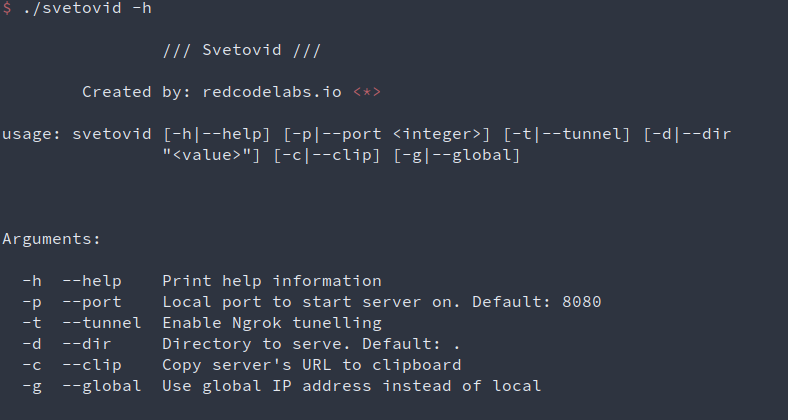

  

  Post-exploitation scripts and binaries + reverse proxy server

       

## Introduction

This repository gathers useful post-exploitation assets (for Windows and Linux) from various sources.

It comes with a HTTP fileserver (`svetovid.go`) that supports content forwarding with Ngrok tunnel.

Such approach allows downloading stuff from behind NAT.

## Requirements

- https://github.com/redcode-labs/Coldfire
- https://github.com/akamensky/argparse
- https://github.com/atotto/clipboard	
- https://github.com/fatih/color

## Usage

  

## Directory layout

There are 3 main folders:

- `linux`
- `windows`
- `python`

Scripts under `python` are platform-agnostic. Content inside `linux` and `windows` is further divided into 3 subfolders:

- `x86`     - binaries that can be launched on 32-bit systems
- `x64`     - binaries that can be launched on 64-bit systems
- `multi` - scripts and binaries that can be launched on both 32-bit and 64-bit systems

## License
This software is under [MIT License](https://en.wikipedia.org/wiki/MIT_License)

